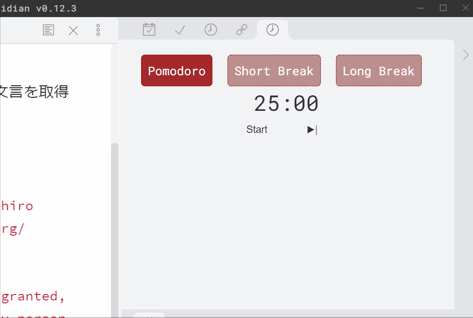
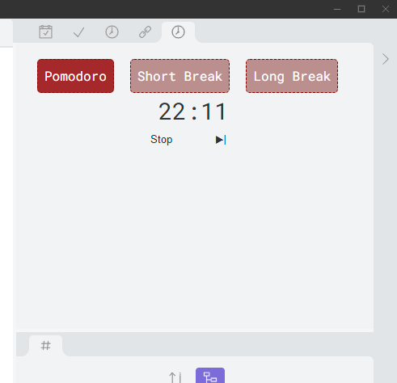
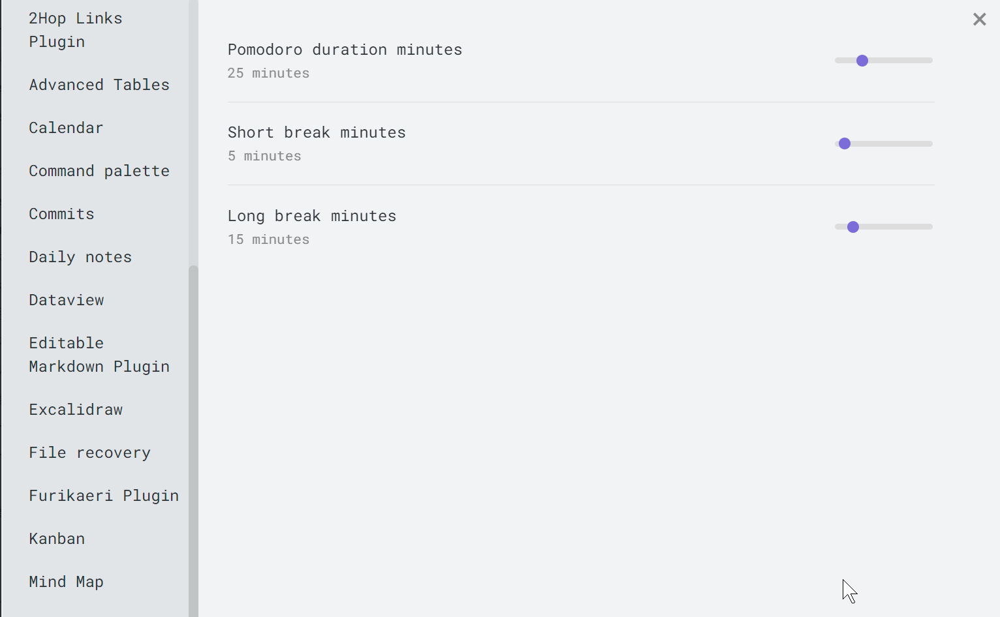

## Obsidian Pomodoro Plugin

"Obsidian Pomodoro Plugin" is a simple Pomodoro timer plugin for Obsidian (https://obsidian.md).

You can put a pomodoro timer in your obsidian window.

> The Pomodoro Technique is a time management method developed by Francesco Cirillo in the late 1980s.
> The technique uses a timer to break down work into intervals, traditionally 25 minutes in length, separated by short breaks. Each interval is known as a pomodoro, from the Italian word for 'tomato', after the tomato-shaped kitchen timer that Cirillo used as a university student.
> https://en.wikipedia.org/wiki/Pomodoro_Technique

If you are not familiar with Pomodoro technique, see also:

- https://www.youtube.com/watch?v=H0k0TQfZGSc
- https://en.wikipedia.org/wiki/Pomodoro_Technique

You can change the time duration by the setting form. 

## Thanks to

- @santiyounger suggested me to add pomodoro technique support for [obsidian-stopwatch-plugin](https://github.com/tokuhirom/obsidian-stopwatch-plugin)

### Manually installing the plugin

- Run `npm build`
- Copy over `main.js`, `styles.css`, `manifest.json` to your vault `VaultFolder/.obsidian/plugins/your-plugin-id/`.

## LICENSE

The MIT License (MIT)

Copyright © 2021 Tokuhiro Matsuno, http://64p.org/ <tokuhirom@gmail.com>

Permission is hereby granted, free of charge, to any person obtaining a copy
of this software and associated documentation files (the “Software”), to deal
in the Software without restriction, including without limitation the rights
to use, copy, modify, merge, publish, distribute, sublicense, and/or sell
copies of the Software, and to permit persons to whom the Software is
furnished to do so, subject to the following conditions:

The above copyright notice and this permission notice shall be included in
all copies or substantial portions of the Software.

THE SOFTWARE IS PROVIDED “AS IS”, WITHOUT WARRANTY OF ANY KIND, EXPRESS OR
IMPLIED, INCLUDING BUT NOT LIMITED TO THE WARRANTIES OF MERCHANTABILITY,
FITNESS FOR A PARTICULAR PURPOSE AND NONINFRINGEMENT. IN NO EVENT SHALL THE
AUTHORS OR COPYRIGHT HOLDERS BE LIABLE FOR ANY CLAIM, DAMAGES OR OTHER
LIABILITY, WHETHER IN AN ACTION OF CONTRACT, TORT OR OTHERWISE, ARISING FROM,
OUT OF OR IN CONNECTION WITH THE SOFTWARE OR THE USE OR OTHER DEALINGS IN
THE SOFTWARE.
